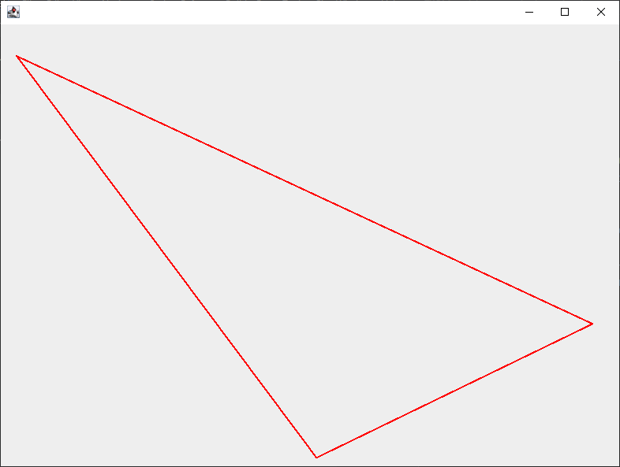
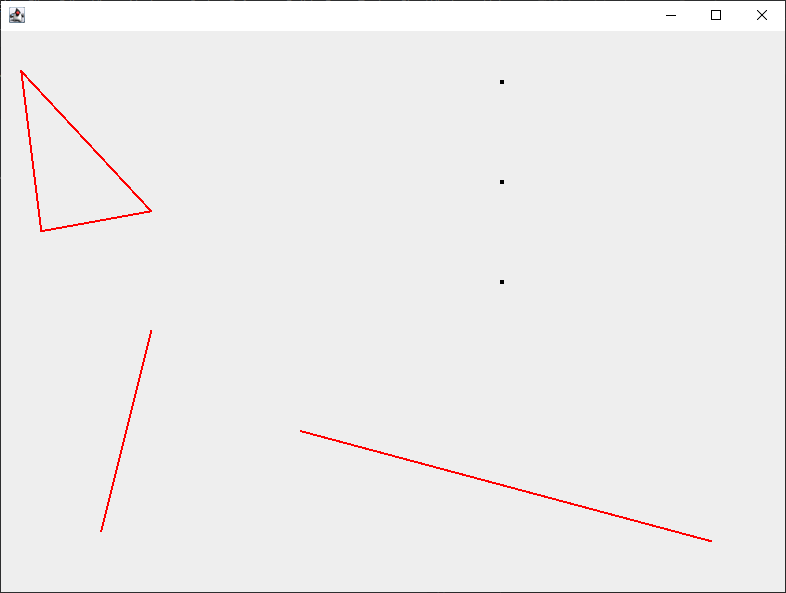

# Przykłady kodu w zaprojektowanym języku

## Wywołnie funkcji zdefiniowanej przez użytkownika

```
Int main() {
	doSomeMath(1).print()

    List[Int] myList = [Int];
    myList.add(1);
    myList.add(12);
    myList.add(123);
    myList.print();

	return 0;
}

Int doSomeMath(Int n) {
   if ((n < 0) || (n == 0) || (n == 1)) {
      return 11;
   }

   Int i = 2;
   Int result = 0;
   while (i < n) {
      result = result - i * (i + n - i);
      i = i + 3;
   }

   return result;
}
```

Oraz efekty wykonania:

```
11
IntListValueScene[1, 12, 123]

Process finished with exit code 0
```

## Rysowanie figur

Poniżej znajdują się 2 przykłady wykorzystania możliwości rysowania w zaprojektowanym języku:

```
Int main() {
	drawTriangle();

	return 0;
}

void drawTriangle() {
   Figure fig = Figure();

   Point p1 = Point(20.0, 40.0);
   Point p2 = Point(750.0, 380.0);
   Point p3 = Point(400.0, 550.0);

   Section s1 = Section(p1, p2);
   Section s2 = Section(p2, p3);
   Section s3 = Section(p3, p1);

   fig.add(s1);
   fig.add(s2);
   fig.add(s3);
   fig.draw();
}
```

Wykonanie powyższego kodu generuje taki obrazek:  


```
Int main() {
	drawScene();

	return 0;
}

void drawScene() {
   Scene scene = Scene();

   Point p1 = Point(20.0, 40.0);
   Point p2 = Point(150.0, 180.0);
   Point p3 = Point(40.0, 200.0);

   Section s1 = Section(p1, p2);
   Section s2 = Section(p2, p3);
   Section s3 = Section(p3, p1);

   Figure fig = Figure();
   fig.add(s1);
   fig.add(s2);
   fig.add(s3);

   scene.add(fig);

   Point p4 = Point(500, 50);
   Point p5 = Point(500, 150);
   Point p6 = Point(500, 250);

   scene.add(p4);
   scene.add(p5);
   scene.add(p6);

   Point p4 = Point(100, 500);
   Point p5 = Point(150, 300);
   Section s4 = Section(p4, p5);
   scene.add(s4);

   Point p5 = Point(300, 400);
   Point p6 = Point(710, 510);
   Section s5 = Section(p5, p6);
   scene.add(s5);

   scene.draw();
}
```

Wykonanie powyższego kodu generuje taki obrazek:  


## Przypadki szczególne

W przedstawionych poniżej przykładach wypisywany jest bufor z błędami. Znajduje się od w przedostatniej linii (niżej
będzie tylko komunikat z wykonania kodu `Javy` służącego do uruchomienia interpretera). Błędy będą wypisaną listą w
związku z czym puste nawiasy `[]` oznaczają brak błędów wykonania.

### Przekroczenie dozwolonej liczby wywołań rekurencyjnych

```
Int main() {
	doSomeRecursion(100).print();
	return 0;
}

Int doSomeRecursion(Int n) {
    n.print()
    return doSomeRecursion(n - 1);
}
```

Zwraca następujący wynik:

```
100
99
98
97
96
95
94
93
92
91
90
[visitors.exceptions.ExceededMaxRecursionDepthException: ExceededMaxRecursionDepthException: Function: doSomeRecursion called at position: Position: <line: 8, column 12> exceeded max recursion depth: 10]

Process finished with exit code 1
```

```
Int main() {
	doSomeRecursion(5).print();
	return 0;
}

Int doSomeRecursion(Int n) {
    n.print()
    if (n > 0) {
        return doSomeRecursion(n - 1);
    } else {
        return 0;
    }
}
```

Zwraca następujący wynik:

```
5
4
3
2
1
0
0
[]

Process finished with exit code 0
```

### Przekroczenie dozwolonego rozmiaru stosu dla wywołań funkcji

```
Int main() {
	doSomeRecursion(200).print();
	return 0;
}

Int doSomeRecursion(Int n) {
    n.print()
    return doSomeOtherRecursion(n - 1);
}

Int doSomeOtherRecursion(Int n) {
    n.print()
    return doSomeRecursion(n - 1);
}
```

Zwraca następujący wynik:

```
200
199
198
197
196
195
194
193
192
191
190
...
110
109
108
107
106
105
104
103
102
101
[visitors.exceptions.ExceededFunctionCallStackSizeException: ExceededFunctionCallStackException: Function: doSomeRecursion called at position: Position: <line: 13, column 12> exceeded max function call stack size: 100]

Process finished with exit code 1
```

Wypisanie liczb od `189` do `111` zostało usunięte z powyższego wypisania w celu poprawienia czytelności.

Przykład, gdy liczba wywołań funkcji jest mniejsza niż zdefiniowany rozmiar stosu wywołań:

```
Int main() {
	doSomeRecursion(10).print();
	return 0;
}

Int doSomeRecursion(Int n) {
    n.print()
    if (n) {
        return doSomeOtherRecursion(n - 1);
    }
    return 0;
}

Int doSomeOtherRecursion(Int n) {
    n.print()

    if (n) {
        return doSomeRecursion(n - 1);
    }
    return 0;
}
```

```
10
9
8
7
6
5
4
3
2
1
0
0
[]

Process finished with exit code 0
```
