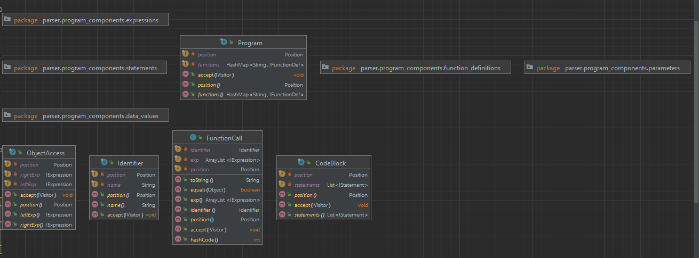
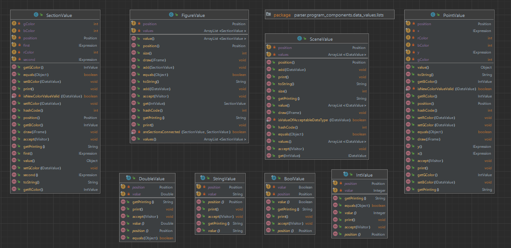
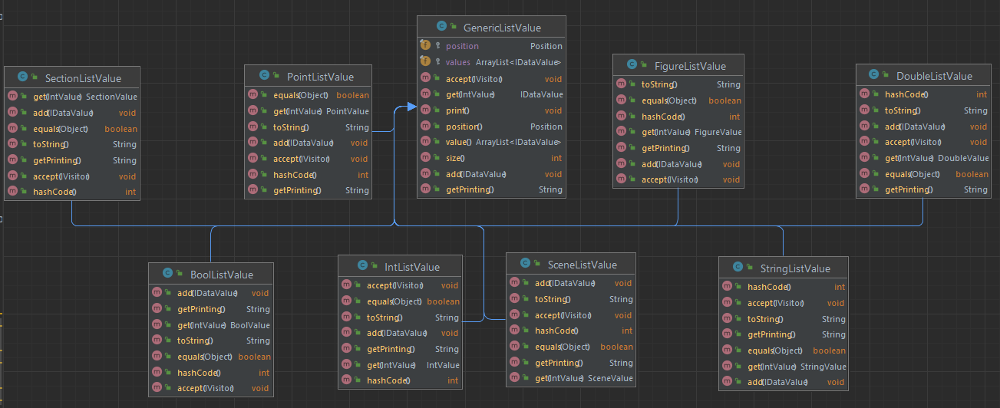
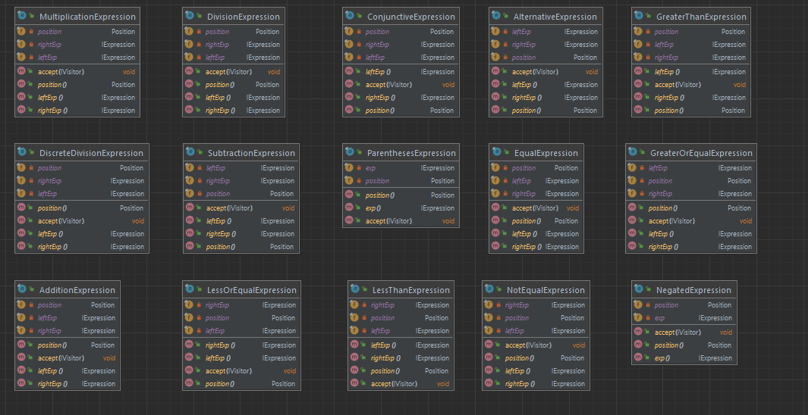
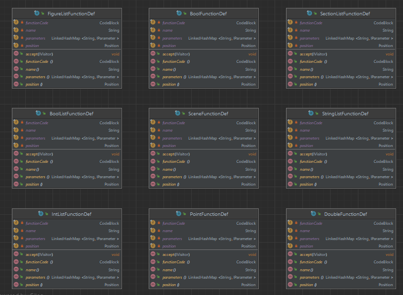
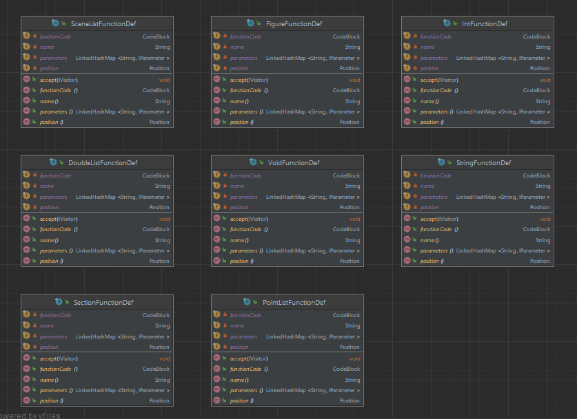
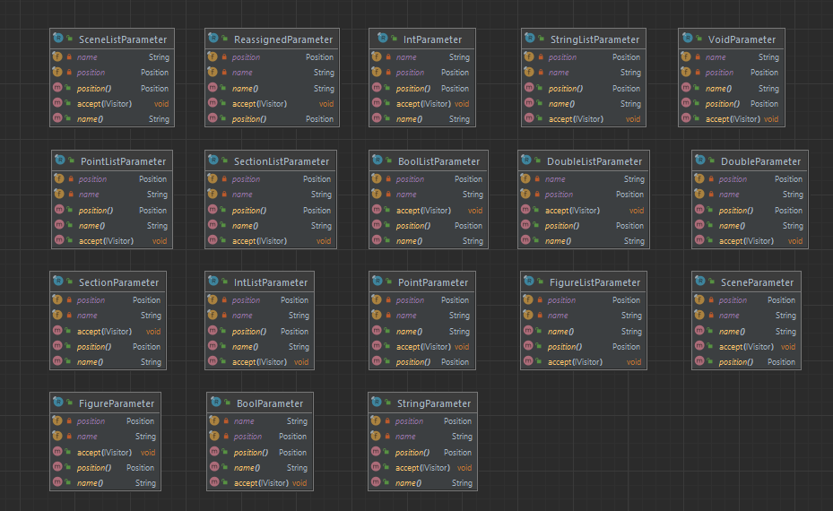
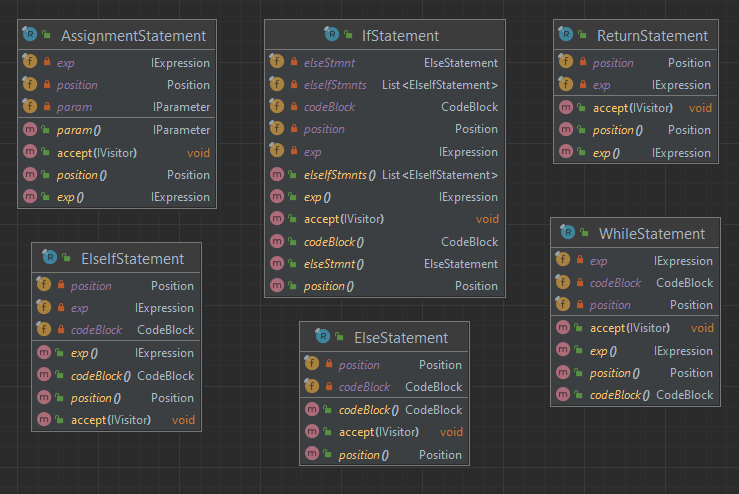

# Dokumentacja struktury programu

## Diagram struktur

Poniżej znajdują się diagramy struktur danych wygenerowane w IDE od firmy `JetBrains` - `IntelliJ IDEA`









## Definicje wbudowanych typów obiektowych

### Wyświetlanie

Obiekty (punkty, odcinki, figury) wyświetlane są przy wykorzystaniu biblioteki `awt` oraz `swing`:

- W bibliotece `awt` znajdują się takie metody jak `drawPolygon(int[] x, int[] y, nPoints)`
  oraz `drawLine(int x1, int y1, int x2, int y2)` przy pomocy których możliwe jest rysowanie krzywych z odcinków oraz
  na podstawie punktów.
- Wyświetlany obrazek umieszczany jest w obiekcie klasy `JFrame` z biblioteki `swing`.

### Point

```
package parser.program_components.data_values;

import lexer.Position;
import parser.IDataValue;
import parser.IExpression;
import visitors.IVisitor;
import visitors.exceptions.IncompatibleMethodArgumentException;

import javax.swing.*;
import java.awt.*;
import java.util.Objects;

public class PointValue implements IDataValue {
    private final Position position;
    private final IExpression x;
    private final IExpression y;
    private int rColor;
    private int gColor;
    private int bColor;


    public PointValue(Position position, IExpression x, IExpression y) {
        this.position = position;
        this.x = x;
        this.y = y;
        rColor = 0;
        gColor = 0;
        bColor = 0;
    }

    private static boolean isNewColorValueValid(IDataValue newColorValue) {
        return newColorValue.getClass().equals(IntValue.class)
                && (((IntValue) newColorValue).value() >= 0 && ((IntValue) newColorValue).value() <= 255);
    }

    @Override
    public void accept(IVisitor visitor) {
        visitor.visit(this);
    }

    @Override
    public Object value() {
        return null;
    }

    @Override
    public boolean equals(Object other) {
        if (!(other instanceof PointValue castedOther)) {
            return false;
        }

        return ((this.x).equals(castedOther.x) && (this.y).equals(castedOther.y));
    }

    @Override
    public String getPrinting() {
        return "Point(" + ((DoubleValue) x).getPrinting() + ", " + ((DoubleValue) y).getPrinting() + ")";
    }

    @Override
    public void print() {
        System.out.println(getPrinting());
    }

    public void draw(JFrame frame) {
        JPanel panel = new JPanel() {
            @Override
            public void paint(Graphics g0) {
                int pointSize = 5;
                DoubleValue xVal = (DoubleValue) x;
                DoubleValue yVal = (DoubleValue) y;
                Graphics2D g = (Graphics2D) g0.create();
                g.setColor(new Color(rColor, gColor, bColor));
                g.fillOval((int) (xVal.value() - pointSize / 2), (int) (yVal.value() - pointSize / 2), pointSize, pointSize);
            }
        };
        frame.add(panel);
        frame.setVisible(true);
    }

    @Override
    public Position position() {
        return position;
    }

    public IExpression x() {
        return x;
    }

    public IExpression y() {
        return y;
    }

    @Override
    public int hashCode() {
        return Objects.hash(position, x, y);
    }

    @Override
    public String toString() {
        return "PointValue[" +
                "position=" + position + ", " +
                "x=" + x + ", " +
                "y=" + y + ']';
    }

    public IntValue getRColor() {
        return new IntValue(position, rColor);
    }

    public void setRColor(IDataValue newColor) throws IncompatibleMethodArgumentException {
        if (isNewColorValueValid(newColor)) {
            rColor = ((IntValue) newColor).value();
        } else {
            throw new IncompatibleMethodArgumentException(this, newColor);
        }
    }

    public IntValue getGColor() {
        return new IntValue(position, gColor);
    }

    public void setGColor(IDataValue newColor) throws IncompatibleMethodArgumentException {
        if (isNewColorValueValid(newColor)) {
            gColor = ((IntValue) newColor).value();
        } else {
            throw new IncompatibleMethodArgumentException(this, newColor);
        }
    }

    public IntValue getBColor() {
        return new IntValue(position, bColor);
    }

    public void setBColor(IDataValue newColor) throws IncompatibleMethodArgumentException {
        if (isNewColorValueValid(newColor)) {
            bColor = ((IntValue) newColor).value();
        } else {
            throw new IncompatibleMethodArgumentException(this, newColor);
        }
    }
}

```

### Section

```
package parser.program_components.data_values;

import lexer.Position;
import parser.IDataValue;
import parser.IExpression;
import visitors.IVisitor;
import visitors.exceptions.IncompatibleMethodArgumentException;

import javax.swing.*;
import java.awt.*;
import java.util.Objects;

public class SectionValue implements IDataValue {
    private final Position position;
    private final IExpression first;
    private final IExpression second;
    private int rColor;
    private int gColor;
    private int bColor;

    public SectionValue(Position position, IExpression first, IExpression second) {
        this.position = position;
        this.first = first;
        this.second = second;
        rColor = 0;
        gColor = 0;
        bColor = 0;
    }

    private static boolean isNewColorValueValid(IDataValue newColorValue) {
        return newColorValue.getClass().equals(IntValue.class)
                && (((IntValue) newColorValue).value() >= 0 && ((IntValue) newColorValue).value() <= 255);
    }

    @Override
    public void accept(IVisitor visitor) {
        visitor.visit(this);
    }

    @Override
    public Object value() {
        return null;
    }

    @Override
    public String getPrinting() {
        return "Section[" + ((IDataValue) first).getPrinting() + ", " + ((IDataValue) second).getPrinting() + "]";
    }

    @Override
    public void print() {
        System.out.println(getPrinting());
    }

    public void draw(JFrame frame) {
        JPanel panel = new JPanel() {
            @Override
            public void paint(Graphics g0) {
                Graphics2D g2d = (Graphics2D) g0;

                float lineWidth = 2.0f;
                g2d.setStroke(new BasicStroke(lineWidth));

                int firstX = ((DoubleValue) ((PointValue) first).x()).value().intValue();
                int firstY = ((DoubleValue) ((PointValue) first).y()).value().intValue();
                int secondX = ((DoubleValue) ((PointValue) second).x()).value().intValue();
                int secondY = ((DoubleValue) ((PointValue) second).y()).value().intValue();

                g2d.setColor(new Color(rColor, gColor, bColor));
                g2d.drawLine(firstX, firstY, secondX, secondY);
            }
        };
        frame.add(panel);
        frame.setVisible(true);
    }

    @Override
    public Position position() {
        return position;
    }

    public IExpression first() {
        return first;
    }

    public IExpression second() {
        return second;
    }

    @Override
    public boolean equals(Object obj) {
        if (obj == this) return true;
        if (obj == null || obj.getClass() != this.getClass()) return false;
        var that = (SectionValue) obj;
        return Objects.equals(this.position, that.position) &&
                Objects.equals(this.first, that.first) &&
                Objects.equals(this.second, that.second);
    }

    @Override
    public int hashCode() {
        return Objects.hash(position, first, second);
    }

    @Override
    public String toString() {
        return "SectionValue[" +
                "position=" + position + ", " +
                "first=" + first + ", " +
                "second=" + second + ']';
    }


    public IntValue getRColor() {
        return new IntValue(position, rColor);
    }

    public void setRColor(IDataValue newColor) throws IncompatibleMethodArgumentException {
        if (isNewColorValueValid(newColor)) {
            rColor = ((IntValue) newColor).value();
        } else {
            throw new IncompatibleMethodArgumentException(this, newColor);
        }
    }

    public IntValue getGColor() {
        return new IntValue(position, gColor);
    }

    public void setGColor(IDataValue newColor) throws IncompatibleMethodArgumentException {
        if (isNewColorValueValid(newColor)) {
            gColor = ((IntValue) newColor).value();
        } else {
            throw new IncompatibleMethodArgumentException(this, newColor);
        }
    }

    public IntValue getBColor() {
        return new IntValue(position, bColor);
    }

    public void setBColor(IDataValue newColor) throws IncompatibleMethodArgumentException {
        if (isNewColorValueValid(newColor)) {
            bColor = ((IntValue) newColor).value();
        } else {
            throw new IncompatibleMethodArgumentException(this, newColor);
        }
    }
}

```

### List

Obiekt typu klasy `List` może przyjmować wszystkie typy obiektowe zdefiniowane w języku z wyłączeniem `List`, tj.: `Int`
, `Double`, `String`, `Point`, `Section`, `Figure`, `Scene`, `Bool`. Zagnieżdżanie list nie jest dozwolone.  
Poniżej przedstawiona jest implementacja generycznej listy. Po tej klasie dziedziczą listy odpowiednich typów:

- `BoolListValue`
- `DoubleListValue`
- `IntListValue`
- `PointListValue`
- `SceneListValue`
- `SectionListValue`
- `StringListValue`

```
package parser.program_components.data_values.lists;

import lexer.Position;
import parser.IDataValue;
import parser.IExtendableDataValue;
import parser.program_components.data_values.IntValue;
import visitors.IVisitor;
import visitors.exceptions.IncompatibleDataTypeException;

import java.util.ArrayList;

public class GenericListValue implements IExtendableDataValue {
    protected final ArrayList<IDataValue> values;
    protected final Position position;

    public GenericListValue(Position position, ArrayList<IDataValue> values) {
        this.values = values;
        this.position = position;
    }

    @Override
    public ArrayList<IDataValue> value() {
        return values;
    }

    @Override
    public Position position() {
        return position;
    }

    @Override
    public void accept(IVisitor visitor) {
        visitor.visit(this);
    }

    @Override
    public IDataValue get(IntValue idx) {
        return values.get(idx.value());
    }

    @Override
    public void add(IDataValue val) throws IncompatibleDataTypeException {
        values.add(val);
    }

    @Override
    public int size() {
        return values.size();
    }


    @Override
    public String getPrinting() {
        StringBuilder printing = new StringBuilder();
        printing.append("Scene[");

        int idx = 0;
        for (IDataValue v : values) {
            if (idx > 0) {
                printing.append(", ");
            }
            printing.append(v.getPrinting());
            idx += 1;
        }
        printing.append("]");
        return printing.toString();
    }

    @Override
    public void print() {
        System.out.println(getPrinting());
    }
}

```

We wcześniejszym akapicie znajduje się [diagram](#diagram-struktur) ilustrujący zależności w
listach.

### Figure

Figura będzie krzywą łamaną, tj. nie będzie konieczności przekazania do niej takich odcinków, aby stworzyła figurę
zamkniętą. Takie podejście wydaje się logiczne z racji na możliwość dodawania kolejnych odcinków do figury. Należy
jednak pamiętać o tym, że kolejny dodawany odcinek powinien się łączyć z ostatnio dodanym odcinkiem.

```
package parser.program_components.data_values;

import lexer.Position;
import parser.IDataValue;
import parser.IExtendableDataValue;
import visitors.IVisitor;
import visitors.exceptions.IncompatibleDataTypeException;
import visitors.exceptions.IncompatibleMethodArgumentException;

import javax.swing.*;
import java.util.ArrayList;
import java.util.Objects;

public class FigureValue implements IExtendableDataValue {
    private final Position position;
    private final ArrayList<SectionValue> values;

    public FigureValue(Position position, ArrayList<SectionValue> values) {
        this.position = position;
        this.values = values;
    }

    public FigureValue(Position position) {
        this(position, new ArrayList<>());
    }

    private static boolean areSectionsConnected(SectionValue previousSection, SectionValue newSection) {
        return previousSection.first().equals(newSection.first()) || previousSection.first().equals(newSection.second())
                || previousSection.second().equals(newSection.first()) || previousSection.second().equals(newSection.second());
    }

    @Override
    public void accept(IVisitor visitor) {
        visitor.visit(this);
    }

    @Override
    public ArrayList<SectionValue> value() {
        return values;
    }

    public void add(SectionValue section) {
        values.add(section);
    }

    @Override
    public Position position() {
        return position;
    }

    public ArrayList<SectionValue> values() {
        return values;
    }

    @Override
    public boolean equals(Object obj) {
        if (obj == this) return true;
        if (obj == null || obj.getClass() != this.getClass()) return false;
        var that = (FigureValue) obj;
        return Objects.equals(this.position, that.position) &&
                Objects.equals(this.values, that.values);
    }

    @Override
    public int hashCode() {
        return Objects.hash(position, values);
    }

    @Override
    public String toString() {
        return "FigureValue[" +
                "position=" + position + ", " +
                "values=" + values + ']';
    }

    @Override
    public void add(IDataValue value) throws IncompatibleMethodArgumentException, IncompatibleDataTypeException {
        if (value.getClass().equals(SectionValue.class)) {
            if (values.size() > 0) {
                SectionValue previousSection = values.get(values.size() - 1);
                SectionValue newSection = (SectionValue) value;
                if (!areSectionsConnected(previousSection, newSection)) {
                    throw new IncompatibleMethodArgumentException(this, newSection);
                }
            }
            values.add((SectionValue) value);
        } else {
            throw new IncompatibleDataTypeException(this, value);
        }
    }

    @Override
    public int size() {
        return values.size();
    }

    @Override
    public SectionValue get(IntValue idx) {
        return values.get(idx.value());
    }

    @Override
    public String getPrinting() {
        StringBuilder printing = new StringBuilder();
        printing.append("Figure[");

        int idx = 0;
        for (IDataValue v : values) {
            if (idx > 0) {
                printing.append(", ");
            }
            printing.append(v.getPrinting());
            idx += 1;
        }
        printing.append("]");
        return printing.toString();
    }

    @Override
    public void print() {
        System.out.println(getPrinting());
    }

    public void draw(JFrame frame) {
        for (SectionValue s : values) {
            s.draw(frame);
        }
    }
}

```

### Scene

```
package parser.program_components.data_values.lists;

import lexer.Position;
import parser.IDataValue;
import parser.program_components.data_values.IntValue;
import parser.program_components.data_values.SceneValue;
import visitors.IVisitor;
import visitors.exceptions.IncompatibleDataTypeException;

import java.util.ArrayList;
import java.util.Objects;

public class SceneListValue extends GenericListValue {
    public SceneListValue(Position position) {
        super(position, new ArrayList<>());
    }

    @Override
    public void accept(IVisitor visitor) {
        visitor.visit(this);
    }

    @Override
    public boolean equals(Object obj) {
        if (obj == this) return true;
        if (obj == null || obj.getClass() != this.getClass()) return false;
        var that = (SceneListValue) obj;
        return Objects.equals(this.position, that.position) &&
                Objects.equals(this.values, that.values);
    }

    @Override
    public int hashCode() {
        return Objects.hash(position, values);
    }

    @Override
    public String toString() {
        return "SceneListValue[" +
                "position=" + position + ", " +
                "values=" + values + ']';
    }

    @Override
    public SceneValue get(IntValue idx) {
        return (SceneValue) values.get(idx.value());
    }

    @Override
    public void add(IDataValue val) throws IncompatibleDataTypeException {
        if (val.getClass().equals(SceneValue.class)) {
            super.add(val);
        } else {
            throw new IncompatibleDataTypeException(this, val);
        }
    }

    @Override
    public String getPrinting() {
        return "SceneListValue" + super.getPrinting();
    }
}

```